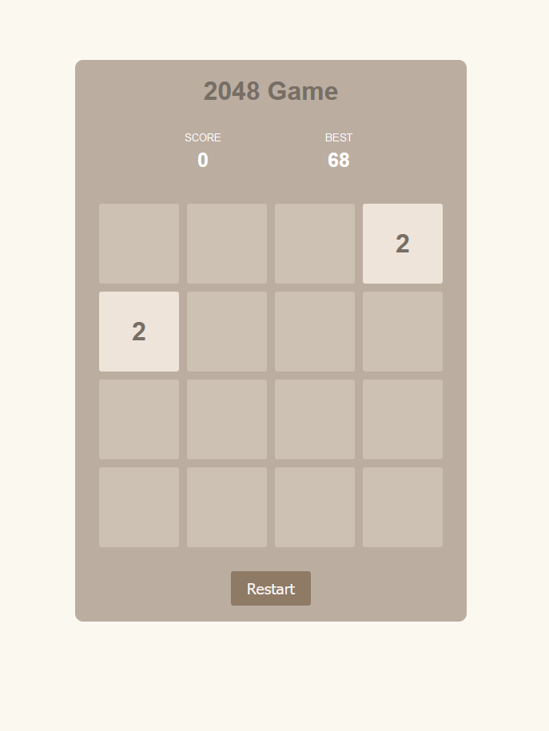

# 2048 Game

This is a simple implementation of the 2048 game using HTML, CSS, and JavaScript.

## How to Run
1. Open `index.html` in a web browser.
2. Click the "Restart" button to start a new game.

## Images

## Features
- Smooth animations
- Simple interface
- Responsive design
- Score tracking
- Best score tracking using local storage

Enjoy playing!
